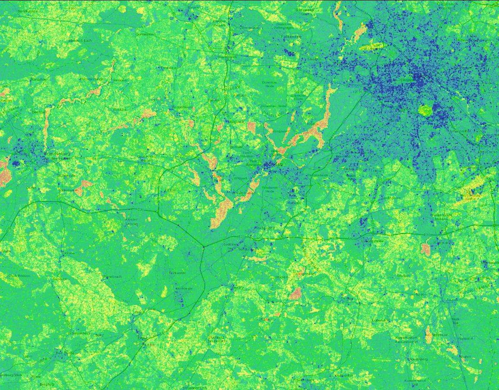
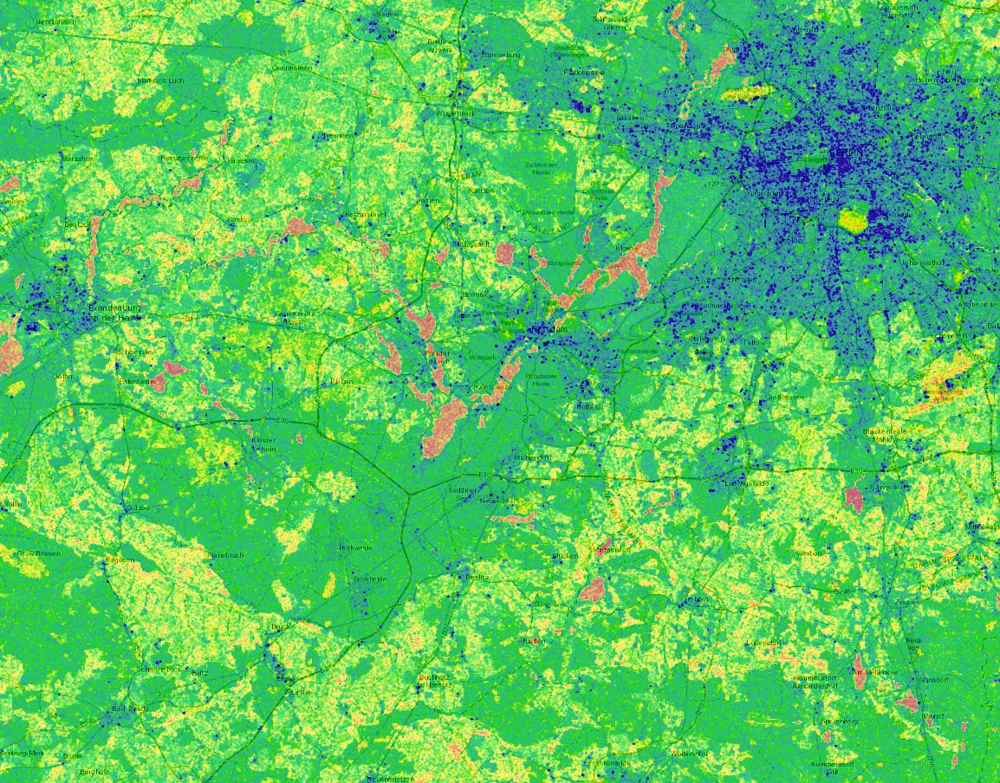

Berlin soil moisture in 2018 
============================
Author: Hubert Asamer


# proposal for soil moisture analysis using S2-MSI & S1-SAR-C
idea behind is to create a spatially harmonized S2 & S1 data source. By using the NDVI of S2-products & the calibrated VV bands of S1 -  all within one container


## why am I doing this?

- providing a single docker image, capable of 
  * doing S1-Terrain Correction & Calibration
  * doing python, gdal-commandline for manual pre & postprocessing

- using the parametrized calls of docker containers to provide mass-processing environments like e.g. `mesos` or `k8s` with processing pipeline `building blocks`
- ...


## docker based snap preprocessing of S1-data

```sh
git clone https://github.com/asamerh4/snap-preprocessing.git
cd snap-preprocessing
```

### build docker image

```sh
cd tools/snap-bundle/
wget https://s3.eu-central-1.amazonaws.com/snap-bundles/bundle.zip
unzip bundle.zip
rm bundle.zip
cd ../..
./build.sh
```
If, for any reason the build fails, you may pull the image using docker pull asamerh4/snap-preprocessing:326be82

### create docker volumes
```sh
docker volume create auxdata
docker volume create s1-input
docker volume create s1-output
```

### initially fetch input-products & auxdata

start container and mount docker volumes (reusable after container lifetime)

```sh
docker run -it --rm \
 -v auxdata:/root/.snap/auxdata/dem/SRTM\ 3Sec/ \
 -v s1-input:/root/input \
 -v s1-output:/root/output \
 asamerh4/snap-preprocessing:326be82 /bin/bash
cd input
#aws cli is provided from container
aws s3 sync s3://snap-bundles/data .
cd ..
cd /root/.snap/auxdata/dem/SRTM\ 3Sec/
aws s3 sync s3://snap-bundles/auxdata/srtm_3sec/tiff .
exit
```

### now create UTM-gridded & calibrated S1-products taking the VV-band into the focus

VV-polarisation is best suited for getting a glimpse of soil-moisture...

```sh
#s1-product 1
docker run -i --rm -v auxdata:/root/.snap/auxdata/dem/SRTM\ 3Sec/ \
 -v s1-input:/root/input \
 -v s1-output:/root/output \
 -e INPUT_PRODUCT="S1B_IW_GRDH_1SDV_20180911T165935_20180911T170000_012670_017612_7BAC.zip" \
 -e OUTPUT_PRODUCT="automatic" asamerh4/snap-preprocessing:812ed42 \
 ./s1-calibrate-warp.py

#s1-product 2
docker run -i --rm -v auxdata:/root/.snap/auxdata/dem/SRTM\ 3Sec/ \
 -v s1-input:/root/input \
 -v s1-output:/root/output \
 -e INPUT_PRODUCT="S1A_IW_GRDH_1SDV_20180807T165207_20180807T165232_023143_02838C_198F.zip." \
 -e OUTPUT_PRODUCT="automatic" asamerh4/snap-preprocessing:812ed42 \
 ./s1-calibrate-warp.py

#create diff
docker run -it --rm \
 -v auxdata:/root/.snap/auxdata/dem/SRTM\ 3Sec/ \
 -v s1-input:/root/input \
 -v s1-output:/root/output \
 asamerh4/snap-preprocessing:326be82 /bin/bash
cd output
ll
#-rw-r--r-- 1 root root 25876496 Oct 24 19:25 S1A_IW_GRDH_1SDV_20180807T165207_20180807T165232_023143_02838C_198F.zip.calib-utm.tif
#-rw-r--r-- 1 root root 64257617 Oct 24 19:25 S1A_IW_GRDH_1SDV_20180807T165207_20180807T165232_023143_02838C_198F.zip.calib.tif
#-rw-r--r-- 1 root root 27168332 Oct 24 19:51 S1B_IW_GRDH_1SDV_20180911T165935_20180911T170000_012670_017612_7BAC.zip.calib-utm.tif
#-rw-r--r-- 1 root root 58283747 Oct 24 19:51 S1B_IW_GRDH_1SDV_20180911T165935_20180911T170000_012670_017612_7BAC.zip.calib.tif

gdal_translate -projwin 262000 5855000 503000 5730000 S1B_IW_GRDH_1SDV_20180911T165935_20180911T170000_012670_017612_7BAC.zip.calib-utm.tif S1B_IW_GRDH_1SDV_20180911T165935_20180911T170000_012670_017612_7BAC.zip.calib-utm-clip.tif

gdal_translate -projwin 262000 5855000 503000 5730000 S1A_IW_GRDH_1SDV_20180807T165207_20180807T165232_023143_02838C_198F.zip.calib-utm.tif S1A_IW_GRDH_1SDV_20180807T165207_20180807T165232_023143_02838C_198F.zip.calib-utm-clip.tif

gdal_calc.py -A S1B_IW_GRDH_1SDV_20180911T165935_20180911T170000_012670_017612_7BAC.zip.calib-utm-clip.tif -B S1A_IW_GRDH_1SDV_20180807T165207_20180807T165232_023143_02838C_198F.zip.calib-utm-clip.tif  --outfile=sigma0_diff.tif --calc="A-B"

ll
#-rw-r--r-- 1 root root 12060412 Oct 24 20:13 S1A_IW_GRDH_1SDV_20180807T165207_20180807T165232_023143_02838C_198F.zip.calib-utm-clip.tif
#-rw-r--r-- 1 root root 25876496 Oct 24 19:25 S1A_IW_GRDH_1SDV_20180807T165207_20180807T165232_023143_02838C_198F.zip.calib-utm.tif
#-rw-r--r-- 1 root root 64257617 Oct 24 19:25 S1A_IW_GRDH_1SDV_20180807T165207_20180807T165232_023143_02838C_198F.zip.calib.tif
#-rw-r--r-- 1 root root 12060412 Oct 24 20:14 S1B_IW_GRDH_1SDV_20180911T165935_20180911T170000_012670_017612_7BAC.zip.calib-utm-clip.tif
#-rw-r--r-- 1 root root 27168332 Oct 24 19:51 S1B_IW_GRDH_1SDV_20180911T165935_20180911T170000_012670_017612_7BAC.zip.calib-utm.tif
#-rw-r--r-- 1 root root 58283747 Oct 24 19:51 S1B_IW_GRDH_1SDV_20180911T165935_20180911T170000_012670_017612_7BAC.zip.calib.tif
#-rw-r--r-- 1 root root 12070740 Oct 24 20:15 sigma0_diff.tif
```

### further steps, that could make sense
- create NDVI product from each S2-Dataset
- create NDVI-min & max grids by using all S2-products
- use calibrated S1-products & sigma diff-grid and combine S2&S1 (ref is: https://www.ncbi.nlm.nih.gov/pmc/articles/PMC5621168/)

### results viz

->


